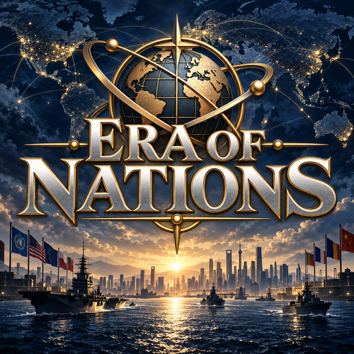

# Era of Nations

A standalone Hearts of Iron IV fork, beginning with an inherited modern era gameplay baseline. The first development build changes the project name, presentation, and local setup; the source gameplay remains the starting point for future work.

Development repository: [Sany0ssse/Era-of-Nations](https://github.com/Sany0ssse/Era-of-Nations).

- [Local setup](docs/development/SETUP.md)
- [Source and attribution](docs/development/SOURCE.md)
- [Current validation status](docs/development/STATUS.md)
- [Contributing](CONTRIBUTING.md)
- [Inherited authors and asset credits](docs/misc/authors.md)

Enable Era of Nations by itself in a dedicated launcher playset. Steam Workshop publication is reserved for a later stage of development.
