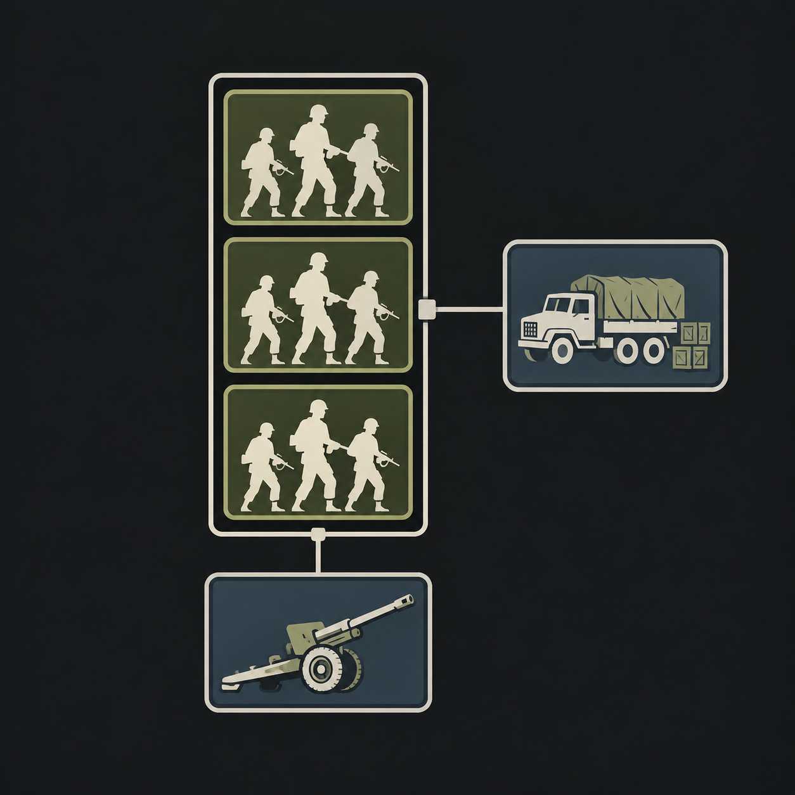

# Організація дивізій і полкова підтримка

Сітка конструктора — це організаційна схема. Ряд зверху не означає першу
лінію бою, а ряд знизу — тил. Той самий склад, переставлений зверху вниз,
не повинен автоматично програвати: місце батальйону в списку не показує,
де командир застосує його під час конкретного бою.

У HOI4 1.19 стовпці мають практичне значення: кожен утворює полк, до якого
можна додати сумісну полкову підтримку. Це відрізняється від тактичного
розгортання. [Офіційний опис Paradox](https://store.steampowered.com/news/posts/?appgroupname=Hearts+of+Iron+IV%3A+Cadet+Edition&appids=394360&enddate=1779448700&feed=steam_community_announcements)
пояснює мінімальну кількість батальйонів і сумісність підтримки. У встановленій
1.19.3 значення `REGIMENTAL_SUPPORT_REQUIRED_BATTALIONS` дорівнює `{ 3 }`.

## Що додано

Два нові підрозділи працюють через штатні полкові клітинки рушія:

| Підрозділ | Сумісний стовпець | Оснащення | Люди | Базове постачання |
| --- | --- | --- | --- | --- |
| Легка полкова батарея | Піші батальйони (`infantry`) | 3 одиниці артилерії, 1 засобів управління | 40 | 0.01 |
| Моторизована полкова батарея | Рухомі й бронетанкові батальйони (`mobile`, `armor`) | Те саме + 5 машин | 40 | 0.015 |

В одному відповідному стовпці потрібно щонайменше три сумісні лінійні
батальйони. Це перевірка групи рушія: `infantry` в нашій основі включає й
лінійну артилерію `Arty_Bat`. Три батальйони цієї групи не обов'язково означають
три піхотні батальйони й самі по собі не гарантують збалансованого складу.
Батарея займає нижню клітинку підтримки, не є лінійним батальйоном і не додає
ширини фронту. Її оснащення, організація, витрати та бойові характеристики
враховуються рушієм разом із рештою дивізії. Для моторизованої батареї
передбачені транспорт і пальне. Старі дивізійні роти підтримки залишаються
окремими підрозділами зі своїми характеристиками та шириною фронту.

Числа — обережна ігрова калібровка від чинної `Arty_Battery`: половина
гармат, людей, базового постачання, міцності, організації та базового коефіцієнта
бойових показників, додатково засоби управління і транспорт. Десять
наявних покращень артилерії в обох технологічних гілках також покращують
нові батареї. Доктрини й загальні категорійні бонуси застосовує рушій;
кінцеві бойові показники не обіцяні як точна половина старої батареї.
Це не універсальний реальний штат батареї: організація армій
відрізняється між країнами, часом і завданнями.

В окремих наявних легких і моторизованих шаблонах ШІ додано по одній
відповідній батареї. Виправлені неправильні посилання `SP_AA_battery` та
заміна батареї підтримки лінійним зенітним батальйоном у бронетанковому
шаблоні. Також закриті прогалини фабричних порогів: легка морська піхота
до 5 заводів включно, моторизована — 6–9; базовий шаблон БМП до 16,
великий — від 17. Чинні вимоги верфі й обмеження рангу збережені.
Додано відсутню категорію полкової підтримки до реєстру моду та прибрано
посилання на неіснуючу ванільну піхоту з початкової технології. Наявні
спеціальні війська залишаються активними й доступними за старим ID.
Власні шаблони гравець змінює у звичайному конструкторі.

## Пояснення у грі

При першому вході за країну в кампанії відкривається коротке вікно із
зображенням організаційної схеми. Додаткові сторінки про склад та постачання
відкриваються лише за бажанням. Закрити довідку можна на кожній сторінці.

Повторне відкриття: **Решения → Помощь по составу дивизий → Открыть
руководство по дивизиям**. Це безкоштовна довідка. Вона не дає бонусів
і не змінює ресурси. Показ прив'язаний до країни у збереженні; інший гравець,
який згодом зайде за вже ознайомлену країну, користується повторним відкриттям.
Ботам вікно не показується. Старі кампанії й країни, які вперше переходять
під керування людини, отримують пояснення через щоденну перевірку.

У самому конструкторі є підказки до заголовків складу, дивізійної та
полкової підтримки. Англійська й російська локалізації входять у пакет.

## Чому це ближче до реальності

Сила з'єднання залежить від взаємодії різних підрозділів, управління,
підготовки та забезпечення. Сучасна доктрина описує взаємодоповнюючі
можливості, а не перемогу через порядок іконок у таблиці.
[Пояснення Army University / Fort Leonard Wood](https://home.army.mil/wood/contact/publications/cr_mag-2/Multidomain-Operations-The-Latest-Evolution-of-Operational-Doctrine)
розглядає поєднання цих можливостей. Це джерело принципу взаємодії,
а не доказ наших числових коефіцієнтів або універсальна доктрина всіх країн.

HOI4 уже враховує склад через організацію, атаку, оборону, прорив, броню,
бронебійність, швидкість, ширину фронту, оснащення й постачання. Результат
бою також залежить від місцевості, командирів, планування, повітряної
підтримки й випадковості. Немає чесної гарантії, що певний шаблон завжди
знищить інший «за рівних умов».

## Перевірка і межі

Команди перевірок та точний статус ігрової проби наведені в
[README перевірок](../../tools/validation/division_design/README.md).
Перевірка структури джерел відділена від нативного завантаження та від
інтерактивного тесту конструктора й мультиплеєра. Скрипт створення шаблону
може обходити обмеження GUI, тому його успіх не доводить, що GUI відхиляє
кожний некоректний варіант.

Фінальна приватна проба91 у HOI4 1.19.3 пройшла **28/28 перевірок** для
Непалу, Німеччини, Франції та Індії: обидві батареї є в реально розгорнутих
дивізіях, шаблони зареєстровані, одноразовий прапорець довідки отримує
країна гравця, а не країни ШІ. Шість груп перевірок джерела також пройшли.
Це не ручна перевірка натискання вікон, клітинок конструктора або MP.

Проби89/90 збережено як невдалі. Перша виявила відсутню категорію й
помилку області створення військ у тестовій сцені. Друга вже підтвердила
розгорнуті батареї, але використала одну перевірку в неправильній області
та старий лічильник складу шаблону, який не бачить полкову підтримку.
Тест виправлений; спостереження старого лічильника залишені окремо від
28 успішних умов проби91. Результати попередніх спроб не зараховуються
як успішна перевірка.

Окремо виявлено стару помилку обгортки `sub_unit_bonus` у надважкій
танковій піддоктрині (`land_equipment.txt`). Вона вже є в попередньому
запуску 88. Вона стосується базових бонусів цієї піддоктрини, а не
додавання нових батарей; окремі нагороди лежать поза помилковою обгорткою.
Її перенесення між бонусами батальйонів і техніки змінює баланс та
охоплення обладнання, тому в цьому пакеті її не перебудовано. Весь мод
не оголошується вільним від помилок.

## Ілюстрація

Зображення створене вбудованим `image_gen`; ігрова копія конвертована
у 200×180 DDS зі збереженням пропорцій. Це схема підпорядкування: три
клітинки батальйонів, артилерійська підтримка знизу та логістична справа.
Картинка не показує бойових відстаней або тактичних ліній.

Prompt: "Create a small polished military organization illustration for an
educational popup in Era of Nations, a modern Hearts of Iron IV strategy mod.
A clean restrained steel blue, muted olive and warm off-white visual on a
charcoal background, easy on the eyes, no purple. Square composition designed
to remain readable at only 200x180 pixels. This is an ORGANIZATIONAL CHART,
NOT a literal battlefield or front/rear deployment. Depict three simple
equal-size infantry battalion unit tiles grouped vertically within ONE thin
regiment outline, a smaller artillery support tile attached below the same
regiment outline with a short connector, and a separate logistics support
tile on the right attached to the overall organization rather than a battle
line. Use simple large recognizable silhouettes of soldiers, a towed artillery
piece and a supply truck, no modern nation flags, no combat/explosions, no
photorealistic text. No words, letters, numbers, labels, badges or decorative
tiny text anywhere. Strong simple contrast, elegant compact game interface
infographic, accurately convey a regiment contains battalions and receives
support. Leave a little dark breathing room around edges."
